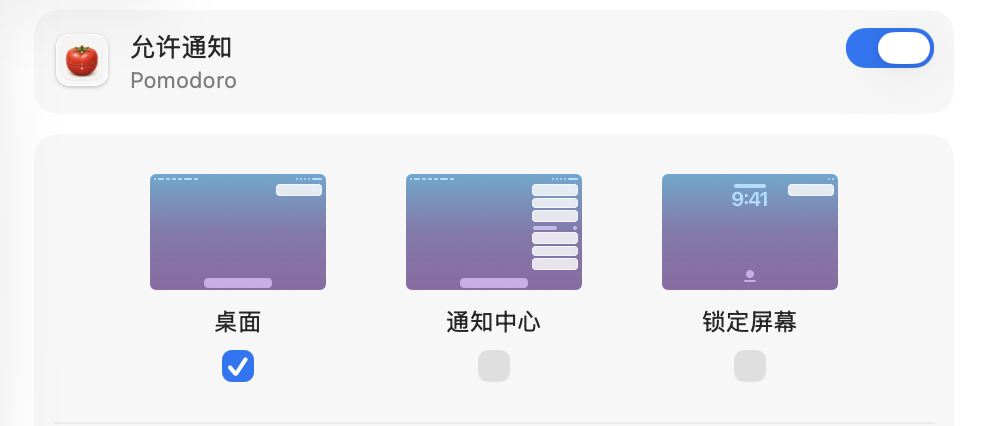

# Pomodoro

macOS 菜单栏番茄时钟。只做一件事：判断你是在连续工作，还是已经该休息。


## 功能

- **菜单栏常驻**：不打开窗口，不占用终端。
- **自动状态切换**：只有 `Working` / `Resting` 两种状态。
- **休息提醒**：连续工作 45 分钟后发送 `Time to rest`。
- **无活动识别**：连续 10 分钟无操作，自动进入休息，不额外打扰。
- **本地运行**：不登录、不联网、不上传数据。
- **CLI 控制**：`pomodoro start` / `pomodoro stop`。

## 状态逻辑

启动后进入 `Working`，菜单栏显示已工作时间，例如 `Working · 32m`。

### `Working` -> `Resting`

满足任一条件就会进入 `Resting`：

| 条件 | 行为 |
| --- | --- |
| 连续工作满 45 分钟 | 发送 `Time to rest`，然后进入 `Resting` |
| 连续 10 分钟没有操作 | 直接进入 `Resting`，不发送通知 |

### `Resting` -> `Working`

必须同时满足两个条件才会回到 `Working`：

| 条件 | 说明 |
| --- | --- |
| 已经处于 `Resting` 至少 5 分钟 | 不满 5 分钟不会重新计时 |
| 5 分钟后检测到新的用户操作 | 没有新操作就继续保持 `Resting` |

一句话：休息满 5 分钟，并且你重新操作电脑，才开始下一轮工作计时。

## 截图




## 安装

```bash
curl -sSL https://raw.githubusercontent.com/mctang24/pomodoro-clock/main/install.sh | bash
```

要求：macOS 13+，已安装 Swift / Xcode Command Line Tools。

## 使用

```bash
pomodoro start   # 启动菜单栏应用
pomodoro stop    # 停止菜单栏应用
```

## 项目结构

| 路径 | 说明 |
| --- | --- |
| `Sources/PomodoroCore/` | 状态机核心逻辑 |
| `Sources/Pomodoro/` | macOS 菜单栏应用 |
| `Sources/PomodoroCLI/` | CLI 入口 |
| `Sources/PomodoroSupport/` | 进程控制、运行路径、资源文件 |
| `Tests/PomodoroTests/` | 单元测试 |

## 开发

```bash
swift test
swift build
```

## License

MIT License
