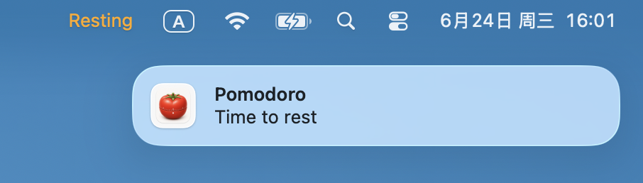

# Pomodoro

[English](README.md) | [简体中文](README.zh-CN.md)

A minimal macOS menu bar Pomodoro timer that detects sustained work and sends a quiet reminder when it is time to rest.

| Working | Rest Reminder |
| --- | --- |
|  |  |


## Why Pomodoro

Pomodoro is intentionally small. It runs locally, lives in the menu bar, and keeps only two states: `Working` and `Resting`. There is no task list, no reporting, no account, and no configuration system.

The app focuses on one job: notice when you have been working for too long, then nudge you to take a short break without interrupting your flow.

## Behavior

After `pomodoro start`, the app enters `Working` and shows the elapsed work time in the menu bar, such as `Working · 32m`.

### `Working` -> `Resting`

The app switches to `Resting` when either condition is met:

| Condition | Behavior |
| --- | --- |
| 45 minutes of continuous work | Sends `Time to rest`, then enters `Resting` |
| 10 minutes without user activity | Enters `Resting` without sending a notification |

### `Resting` -> `Working`

The app starts a new work session only after both conditions are met:

| Condition | Behavior |
| --- | --- |
| At least 5 minutes in `Resting` | The rest guard period has completed |
| New user activity after the guard period | A new `Working` session begins |

In short: rest for at least 5 minutes, then use the Mac again to start the next work session.

## Install

```bash
curl -sSL https://raw.githubusercontent.com/mctang24/pomodoro-clock/main/install.sh | bash
```

Requirements: macOS 13+ with Swift / Xcode Command Line Tools installed.

## Usage

```bash
pomodoro start   # Start the menu bar app
pomodoro stop    # Stop the menu bar app
```

## Project Layout

| Path | Purpose |
| --- | --- |
| `Sources/PomodoroCore/` | Testable state machine logic |
| `Sources/Pomodoro/` | macOS menu bar app |
| `Sources/PomodoroCLI/` | Command-line entry point |
| `Sources/PomodoroSupport/` | Process control, runtime paths, and resources |
| `Tests/PomodoroTests/` | Unit tests |

## License

MIT License
